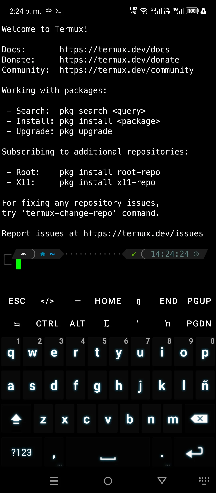

# **CORE-TERMUX**

<p align="center">
  
</p>

<p align="center">
  <strong>Automate your web development environment setup in Termux!</strong>
</p>

<p align="center">
  
  
  
  <a href="https://youtube.com/@devcorex?si=NNuXTcjqGPGISetL"></a>
</p>

**Core-Termux** is a powerful tool designed to streamline the setup of a modern web development environment directly on your Android device using the Termux app. Whether you're a beginner or an experienced developer, this project will help you get started quickly and efficiently.

---

## **📸 Screenshots**

<p align="center">
  
  
</p>
<p align="center">
  <em>Showcasing the Powerlevel10k prompt and NvChad editor.</em>
</p>

---

## **✨ Features**

- 🚀 **Fully Automated Setup**: Get your development environment ready with just one command.
- 💻 **Professional Code Editor**: Pre-configured Neovim with the blazingly fast **NvChad** framework.
- 🎨 **Enhanced Shell Experience**: A beautiful and powerful shell powered by **Oh My Zsh** and **Powerlevel10k**.
- 📦 **Essential Packages**: Comes with a curated list of packages for web development, databases, and more.
- 🤖 **AI-Powered Tools**: Integrated AI assistants like **Gemini CLI** to boost your productivity.
- 🔄 **Auto-Updates**: Keep your environment and tools up to date without running commands.

---

## **🚀 Your Professional Code Editor: Neovim + NvChad**

<p align="center">
  
</p>

Core-Termux doesn't just set up your environment; it gives you a powerful, pre-configured code editor right out of the box with **NvChad**.

NvChad is a blazingly fast Neovim configuration that provides a stunning UI and a rich set of features for modern web development, including:

- **Stunning UI**: A beautiful and functional interface.
- **Integrated File Explorer**: Manage your files with NvimTree.
- **Git Integration**: Handle version control seamlessly within the editor.
- **Autocompletion & Snippets**: Write code faster and with fewer errors.
- **[And much more...](https://github.com/DevCoreXOfficial/nvchad-termux)**

With Core-Termux, your NvChad setup is automatically installed and kept up-to-date, giving you a desktop-class coding experience on your Android device.

---

## **🎓 Community & Learning**

Want to see Core-Termux in action or master Neovim? Check out these resources:

- 📺 **YouTube Channel**: [DevCoreX](https://youtube.com/@devcorex?si=NNuXTcjqGPGISetL)
- 🎓 **Neovim Course**: [Neovim - NvChad](https://youtu.be/Uqgvzd7Sec0?si=2I-2WIFwZOB7sCkR)

---

## **📋 Prerequisites**

- **Minimum 8GB** of available storage.
- **Termux App** installed.
- **Internet Connection**.
- **Git** installed (`pkg install git`).

---

## **🛠️ Installation**

1.  **Clone the Repository**:
    ```bash
    git clone https://github.com/DevCoreXOfficial/core-termux.git
    cd core-termux
    ```

2.  **Run the Setup Script**:
    ```bash
    bash setup.sh
    ```

---

## **🔄 Update**

The environment is configured to run `update.sh` automatically, so you don't need to worry about manual updates.

However, if you need to force an update, you can do so by running the `update.sh` script again. The update process works as follows:
- **`update.sh`**: Syncs local files with the latest version from the repository.
- **`bootstrap.sh`**: Called by `update.sh` to handle the actual update of all tools and packages.

---

## **📂 Project Structure**

```
core-termux/
├── assets/             # Fonts and images
├── bootstrap.sh        # Called by update.sh, handles the update of all tools
├── config              # Color variables and settings
├── setup.sh            # Main setup script
├── update.sh           # Syncs files and runs bootstrap.sh
├── LICENSE             # Project's license
└── README.md           # This file
```

---

## **📦 Included Software**

<details>
<summary><strong>Click to see the full list of included software</strong></summary>

### **Global Node.js Modules**

**Web Development**
- `@devcorex/dev.x`
- `@nestjs/cli`
- `vercel`
- `live-server`
- `markserv`

**Code Quality**
- `typescript`
- `prettier`
- `psqlformat`

**Utilities**
- `localtunnel`
- `npm-check-updates`
- `ngrok`

**AI Tools**
- `@google/gemini-cli`
- `@qwen-code/qwen-code`

### **Termux Packages**

**Languages**
- `nodejs`, `python`, `php`, `perl`

**Shell & Utilities**
- `zsh`, `curl`, `wget`, `lsd`, `bat`, `tree`, `jq`, `fzf`

**Development**
- `git`, `gh`, `neovim`, `lua-language-server`, `ripgrep`, `stylua`

**Databases**
- `mongodb`, `postgresql`, `mariadb`, `sqlite`

</details>

<details>
<summary><strong>Click to see the full list of Zsh plugins</strong></summary>

- **zsh-defer**: Improves Zsh startup time.
- **powerlevel10k**: A highly customizable and fast theme.
- **zsh-autosuggestions**: Suggests commands based on history.
- **zsh-syntax-highlighting**: Adds syntax highlighting to commands.
- **zsh-history-substring-search**: Substring search in command history.
- **zsh-completions**: Extends Zsh autocomplete.
- **fzf-tab**: Enhances tab completion with fuzzy search.
- **zsh-you-should-use**: Reminds you to use aliases.
- **zsh-autopair**: Auto-completes matching pairs.
- **zsh-better-npm-completion**: Improves npm completion.

</details>

---

## **🎉 Contributing**

Contributions are welcome! Please fork the repository and submit a pull request.

---

## **📄 License**

This project is licensed under the **MIT License**. See the `LICENSE` file for details.

---

<p align="center">
  <em>Thank you for using Core-Termux! Happy coding!</em>
</p>
